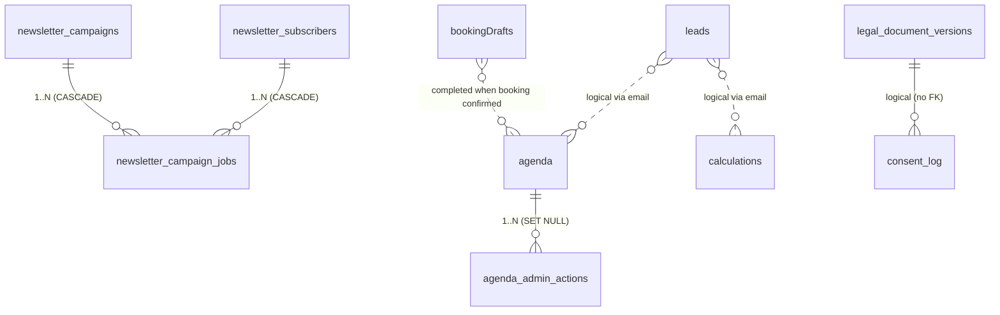

# Data model — Exentax

> Auditoría del **Task #15** (abril 2026). Esta página resume la
> estructura de datos en `exentax-web/shared/schema.ts`, las relaciones
> de integridad, qué se cifra a nivel de campo, y el flujo de
> migraciones que se mantiene a partir de ahora.

## 1. Tablas y propósito

| Tabla | Propósito | Uso principal |
| --- | --- | --- |
| `leads` | Captura de prospectos desde calculadora y formulario de contacto | `routes/public.ts` (calculator + booking lead) |
| `agenda` | Reservas de llamada (1:1) con estado del ciclo de vida | `storage/scheduling.ts`, Discord bot |
| `calculations` | Snapshot de inputs + resultados del simulador (replay/audit) | `routes/public.ts` (`/api/leads/calculator`) |
| `visits` | Tracking de visitas (server-side) | `routes/public.ts` (`/api/visit`) |
| `newsletter_subscribers` | Suscriptores activos/baja con interests | `storage/marketing.ts` |
| `newsletter_campaigns` | Cabecera de broadcast (subject, status) | `scheduled/newsletter-broadcast.ts` |
| `newsletter_campaign_jobs` | Una fila por destinatario × campaña (resumible) | `scheduled/newsletter-broadcast.ts` |
| `blocked_days` | Días bloqueados por el operador (festivos, agotado) | Discord bot `/agenda bloquear` |
| `legal_document_versions` | Versiones legales activas/históricas (TOS/Privacy/…) | `storage/legal.ts` |
| `consent_log` | Audit trail GDPR de cada consentimiento | `storage/marketing.ts` |
| `seo_rankings` | _Reservada_ para snapshots GSC (ver §6) | — (sin uso productivo aún) |
| `email_retry_queue` | Cola persistente de emails transaccionales fallidos | `email-retry-queue.ts` |
| `agenda_admin_actions` | Audit trail de acciones del bot Discord sobre `agenda` | `storage/scheduling.ts` |
| `booking_drafts` | "Carrito abandonado" del formulario de booking | `scheduled/incomplete-bookings.ts` |

## 2. Relaciones (foreign keys)

Las relaciones lógicas están materializadas como **foreign keys** con
`onDelete` decidido caso a caso. Diagrama:



| FK | `onDelete` | Por qué |
| --- | --- | --- |
| `newsletter_campaign_jobs.campaign_id → newsletter_campaigns.id` | `CASCADE` | Un job no tiene sentido fuera de su campaña |
| `newsletter_campaign_jobs.subscriber_id → newsletter_subscribers.id` | `CASCADE` | Un DELETE real de suscriptor (GDPR ejecutado) elimina sus jobs |
| `agenda_admin_actions.booking_id → agenda.id` | `SET NULL` | Audit log debe sobrevivir al borrado de la reserva |

Relaciones **lógicas pero sin FK física**:

- `leads.email ↔ agenda.email`: la captura de leads y la reserva pueden
  llegar por flujos distintos (calculadora vs booking) y el match es
  por email normalizado, no por ID. Imponer FK rompería el caso "lead
  sin reserva".
- `calculations.email ↔ leads.email`: igual razón. La calculadora
  permite simular sin email también, y el lead se registra solo si el
  visitante completa el formulario.
- `consent_log.privacy_version ↔ legal_document_versions.version`: el
  consentimiento referencia la versión activa al momento, pero las
  versiones legales no se borran (audit), así que un FK CASCADE/RESTRICT
  no aporta valor — la versión es texto libre por simplicidad.

## 3. Índices

### Índices de filtros (todos los `WHERE col = ?` y `ORDER BY` están cubiertos)

Los índices clave verificados con `EXPLAIN`:

| Tabla | Índice | Cubre |
| --- | --- | --- |
| `agenda` | `agenda_active_slot_uniq_idx` (UNIQUE PARCIAL) | Garantía de no doble-booking |
| `agenda` | `agenda_email_fecha_reunion_idx` | `hasExistingBooking()` |
| `agenda` | `agenda_estado_fecha_idx` | Listados filtrados por estado + fecha |
| `agenda` | `agenda_manage_token_idx` | Lookup por `manage_token` (cliente) |
| `newsletter_subscribers` | `newsletter_subs_active_idx` (PARCIAL) | `WHERE unsubscribed_at IS NULL` (broadcast) |
| `newsletter_campaign_jobs` | `newsletter_jobs_campaign_status_idx` | Drenado del worker |
| `newsletter_campaign_jobs` | `newsletter_jobs_campaign_subscriber_uniq` (UNIQUE) | Idempotencia anti-duplicado |
| `booking_drafts` | `booking_drafts_pending_sweep_idx` (PARCIAL) | Sweep de drafts pendientes |
| `email_retry_queue` | `email_retry_next_attempt_idx` | Drenado del worker |
| `legal_document_versions` | `legal_doc_versions_type_idx` + `_effective_date_idx` | Lookup de versión activa |

### Índices parciales nuevos (Task #15)

- `newsletter_subs_active_idx` — minimiza tamaño escaneando solo
  suscriptores activos.
- `booking_drafts_pending_sweep_idx` — escanea solo drafts pendientes
  (no completados ni recordados), órdenados por `createdAt`.

## 4. Tipos de columna: `text` vs `timestamp`/`date`

**Decisión** (Task #15, abril 2026): se conservan los campos de fecha
existentes como `text` (ISO-8601 UTC), por las siguientes razones:

1. **Compatibilidad backwards**: la BD productiva tiene años de datos
   en `text`; migrar a `timestamp` requiere `USING ... ::timestamptz`
   y revisar cada lectura del cliente que parsea ISO directamente.
2. **Comparación lexicográfica funciona**: ISO-8601 con offset
   uniforme (siempre UTC, `Z`) ordena correctamente como string —
   `WHERE fecha >= '2026-04-01'` da el mismo resultado que con
   timestamp nativo.
3. **Riesgo > beneficio**: el coste de un FUNDAMENTAL refactor de
   parsing supera el ahorro marginal en tipo de columna. Postgres no
   indexa peor un `text` ISO que un `timestamp` para los patrones de
   acceso actuales (igualdad, rangos lex).

**Excepciones — donde SÍ usamos `timestamp` nativo**:

- `*.fecha_creacion` (todas las tablas): autoinsert con `defaultNow()`
  sin participación del cliente.
- `newsletter_campaigns.started_at`, `completed_at`,
  `newsletter_campaign_jobs.attempted_at`, `sent_at`: escritos solo
  desde el servidor.
- `legal_document_versions.created_at`.

**Excepciones documentadas — campos `text` con semántica de fecha**:

- `leads.fecha`, `calculations.fecha`: cadena humana adicional a
  `fecha_creacion`, mantenida para lectura rápida del operador en
  Discord.
- `agenda.fecha_reunion` (`YYYY-MM-DD`) + `hora_inicio`/`hora_fin`
  (`HH:MM`): partidos en dos columnas porque la booleana de
  disponibilidad combina ambos en filtros y formato local Madrid.
- `*.consentimiento_fecha_hora`, `*.timestamp` (`consent_log`):
  ISO-8601 fijo para audit GDPR. Reproducible en evidencia legal.

## 5. Cifrado de campo (PII)

Implementación: `server/field-encryption.ts` (AES-256-GCM, prefijo `ef:`,
clave maestra en `FIELD_ENCRYPTION_KEY` — 64 hex chars).

| Tabla | Campo | Justificación |
| --- | --- | --- |
| `agenda` | `phone` | Teléfono = PII directo, no necesario para joins/filtros — sólo para contacto manual |
| `leads` | `phone` | Igual razón |

**No se cifran** (con justificación):

- `email`: usado como clave de búsqueda (`hasExistingBooking`,
  `markBookingDraftCompleted`, lookup unsubscribe). Cifrarlo rompería
  los índices `*_email_idx`. Mitigación: mascarado en logs vía
  `maskEmail()`.
- `name`: usado en filtros (Discord `/agenda buscar`) y en plantillas
  de email; misma razón.
- `notas`, `contexto`, `nota_compartir`: feedback libre del visitante.
  Riesgo bajo (no hay número fiscal, dirección postal, etc.).
- `ip`: necesaria para anti-abuse / rate-limit; truncada a /24 antes
  de loggear (vía `correlation.ts`).

**Política de claves**:

- En **producción** la falta de `FIELD_ENCRYPTION_KEY` o un valor
  inválido (≠ 32 bytes) **aborta el arranque** (`field-encryption.ts`
  línea 17/30). Esto es deliberado: nunca debe haber un boot productivo
  sin clave válida.
- En **dev** sin clave, los campos se almacenan en claro y se warnea
  una sola vez. Útil para tests locales.
- **Rotación**: al cambiar la clave, las filas existentes quedan
  ilegibles (los `ef:`-prefixed values incluyen IV+tag pero no key id).
  Procedimiento: leer todo, descifrar con clave vieja, re-encriptar con
  nueva, escribir. **Pendiente** automatizar este script — actualmente
  manual via consola.

## 6. Tablas reservadas / pendientes de uso

- `seo_rankings` — definida y creada (incluida en
  `scripts/verify-backup.ts`) pero **sin código que la lea/escriba**.
  Se conserva porque la tarea SEO planificada (ver
  `docs/seo-audit-report.md`) la poblará desde Google Search Console.
  Si esa tarea se cancela, debe borrarse junto con sus índices y la
  referencia en `verify-backup.ts`.

## 7. Retención y borrado

> La política completa de retención la define la tarea de
> Compliance & Legal (GDPR). Esta sección sólo describe los hooks
> técnicos disponibles.

| Tabla | Hook actual |
| --- | --- |
| `agenda` | Manual desde Discord (`/cita cancelar` → estado `cancelled`, no DELETE) |
| `booking_drafts` | El sweep de incomplete-bookings nunca borra; expiran por `maxAgeMs=24h` en `getBookingDraftsForReminder` |
| `email_retry_queue` | Job borrado en éxito; jobs `attempts >= max_attempts` se conservan para inspección |
| `newsletter_campaign_jobs` | `CASCADE` desde `newsletter_campaigns` (si se borra una campaña) |
| `consent_log` | Append-only — nunca se borra (evidencia GDPR) |
| `legal_document_versions` | Append-only — nunca se borra (audit legal) |
| `visits` | Sin job de purga aún. Crecimiento controlado por baja cardinalidad de IPs únicas |
| `leads` / `calculations` | Sin job de purga aún. PII queda cubierta por cifrado de campo |

## 8. Migraciones

**Fuente de verdad**: `./migrations/*.sql`, generadas por `drizzle-kit
generate` a partir de `shared/schema.ts`.

```bash
# Tras cualquier cambio en shared/schema.ts:
npm run db:generate            # produce ./migrations/NNNN_<name>.sql
# Aplicar a la BD configurada en DATABASE_URL:
npx drizzle-kit migrate        # aplica las migrations pendientes
```

**Red de seguridad de arranque**: `runColumnMigrations()` en
`server/db.ts`. Esta función NO es la fuente de verdad — sólo aplica
deltas idempotentes (IF NOT EXISTS / DO blocks) para garantizar que
una BD legacy (productiva) que nunca corrió el baseline acaba con el
mismo esquema. Cuando se añade un cambio nuevo al schema, se debe:

1. `npm run db:generate` → genera `./migrations/NNNN_*.sql`
2. Añadir a `runColumnMigrations()` la versión idempotente del cambio
   (ALTER TABLE ... IF NOT EXISTS, etc.)
3. Tras confirmar despliegue exitoso en producción, el bloque
   correspondiente en `runColumnMigrations()` puede limpiarse en una
   tarea de housekeeping posterior.

**Migración baseline**: `migrations/0000_baseline.sql` es el snapshot
generado en abril 2026 (Task #15). Para una BD limpia es suficiente
para llegar al esquema actual.

## 9. Verificación

```bash
# Compilar TypeScript:
npm --workspace exentax-web run check

# Arrancar contra una BD de prueba:
DATABASE_URL=postgres://… npm run dev
# → debe loggear "Column migrations applied." sin errores

# Verificar que los índices nuevos se usan:
psql "$DATABASE_URL" -c "EXPLAIN SELECT * FROM newsletter_subscribers WHERE unsubscribed_at IS NULL LIMIT 10;"
# → debe mostrar "Index Scan using newsletter_subs_active_idx"
```

## 10. Sincronización lead ↔ agenda (Task #18, abril 2026)

`leads` no tiene **UNIQUE** sobre `email` (la calculadora puede tocar
varias veces sin que cada simulación cree fila nueva — usa
select-then-update vía `usedCalculator=true`). El flujo de booking,
hasta abril 2026, hacía un `INSERT` ciego con `id = bookingLeadId`,
duplicando la fila cuando el visitante ya tenía un lead previo (caso
típico: calculó primero, reservó después).

**Comportamiento actual** — `upsertLeadOnBooking()` en
`server/storage/marketing.ts`:

1. Busca lead por `email` normalizado dentro de la transacción del
   booking.
2. Si existe → **UPDATE** del row existente:
   - `scheduledCall = true`
   - refresca `firstName`, `source`, consentimientos, IP, `date`
   - preserva `usedCalculator=true` si ya estaba marcado
   - el teléfono se re-encripta sólo si llega uno nuevo
3. Si no existe → `INSERT` con `id = bookingLeadId` (mismo
   comportamiento que antes; el booking E2E sigue verde porque sus
   emails de prueba son siempre nuevos).

**Notificación Discord**: `notifyNewLead()` se dispara **sólo** cuando
realmente insertamos una fila nueva. En el camino upsert, la tarjeta
`notifyBookingCreated()` ya cubre la señal operativa para el operador.

**Race-safety**: el upsert se envuelve en `withLeadEmailLock(email,
…)` (`server/route-helpers.ts`), un lock distribuido por email
backed por Redis (`SET NX PX`) en producción y por una promise chain
in-memory en dev. El mismo lock se aplica al handler de calculadora,
así que dos POSTs simultáneos del mismo email — incluso desde flujos
distintos (calculadora + booking) — se serializan y la segunda ve la
fila creada por la primera.

**Implicación para retención**: el lead "sobrevive" a la cancelación
de la reserva (la fila de `leads` no se borra cuando `agenda.estado =
cancelled`), así que un visitante que cancele y vuelva a reservar
dispara también el camino upsert. Es el comportamiento esperado: la
fila de `leads` es el ledger histórico del prospecto, no un mirror del
estado de `agenda`.
